# HW5: Обеспечение воспроизводимости эксперимента

**Автор:** Смирнова Анастасия  

**Группа:** РМ2

**Дата:** 22.04.2026

---

## Структура проекта
```text
hw5_mlops_Smirnova_Anastasia/
├── .dvc/ # Служебная папка DVC
├── .dvcignore # Исключения DVC
├── .gitignore # Исключения Git
├── data/raw/ # Данные (отслеживаются DVC)
│ ├── .gitignore # Игнорирует *.csv
│ └── iris.csv.dvc # Метафайл DVC
├── src/ # Исходный код
│ ├── prepare.py # Подготовка данных
│ └── train.py # Обучение с MLflow
├── feature_repo/feature_repo/ # Конфигурация Feast
│ ├── feature_store.yaml # Конфиг (PostgreSQL)
│ └── feature_definitions.py # Entity и FeatureView
├── notebooks/
│ └── marimo_demo.py # Демо Marimo
├── screenshots/ # Скриншоты (7 файлов)
├── docker-compose-diagram.yml # Архитектура ML-системы
├── dvc.yaml # DVC пайплайн
├── dvc.lock # Версии данных
├── params.yaml # Параметры эксперимента
├── requirements.txt # Зависимости
└── README.md # Этот файл
```

---

## 1. Ограничения Colab vs Marimo

### 1.1 Скрытое состояние в Colab

В Jupyter/Colab удаление ячейки **не удаляет переменные из памяти**, что приводит к невоспроизводимым результатам.


>**Пример**

>Исходный код:
>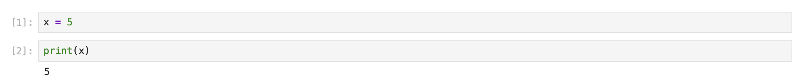

>После удаления ячейки 1, результат `print` сохраняется. Ячейка с `x = 5` удалена, но `print(x)` всё ещё выводит 5.:
>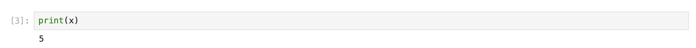


### 1.2 Реактивность в Marimo

Marimo автоматически пересчитывает зависимые ячейки при изменении данных.

>**Пример**
>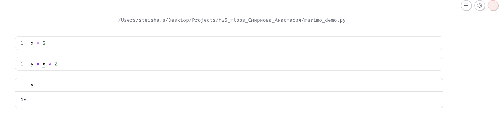
>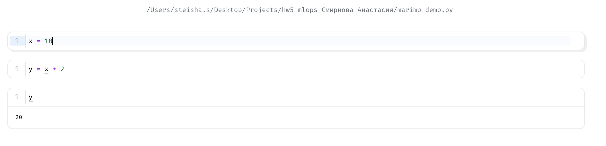
>*Изменение `x` с 5 на 10 автоматически обновило `y`.*

### 1.3 Проблема версионирования .ipynb

| Формат | Git diff |
|--------|----------|
| `.py` | Читаемый diff |
| `.ipynb` | Нечитаемый JSON |

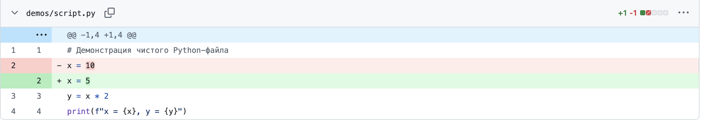
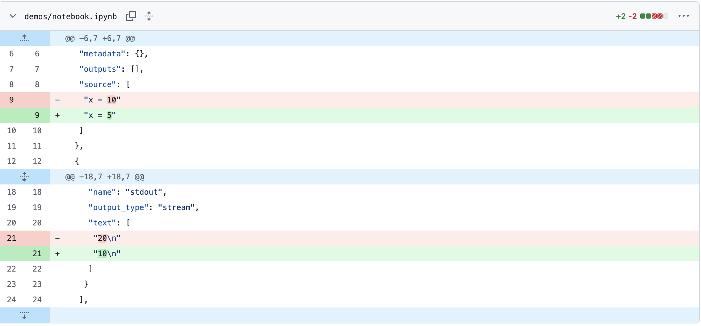

### Вывод

Традиционные ноутбуки `Colab` или `Jupyter` обладают существенным недостатком - наличием скрытого состояния, когда порядок выполнения ячеек влияет на результат, а удаленный код может продолжать влиять на переменные. Это делает эксперименты невоспроизводимыми. `Marimo` решает эту проблему за счет реактивной модели: изменение в любой ячейке автоматически запускает пересчет всех связанных блоков и удаляет неиспользуемые переменные. Это гарантирует, что состояние блокнота полностью соответствует написанному коду. Кроме того, `Marimo` сохраняет блокнот как .py файл, что удобно для версионирования в Git и код-ревью, в отличие от громоздких JSON-структур .ipynb.

---

## 2. Воспроизводимость с DVC и MLflow
### 2.1 DVC пайплайн

```yaml
stages:
  prepare:
    cmd: python src/prepare.py
    deps: [src/prepare.py, data/raw/iris.csv]
    params: [prepare.split_ratio, prepare.random_state]
    outs: [data/processed/train.csv, data/processed/test.csv]
  
  train:
    cmd: python src/train.py
    deps: [src/train.py, data/processed/train.csv]
    params: [train.model_type, train.n_estimators]
    outs: [models/model.pkl]
    metrics: [metrics.json]
```

### 2.2 Запуск проекта
```bash
git clone https://github.com/steishas/hw5_mlops_Smirnova_Anastasia.git
cd hw5_mlops_Smirnova_Anastasia
python -m venv venv && source venv/bin/activate
pip install -r requirements.txt
dvc pull
dvc repro
```
### 2.3 MLflow Tracking

```bash
mlflow ui --backend-store-uri sqlite:///mlflow.db
# Открыть http://localhost:5000
```

Эксперименты логируются в MLflow. Ниже представлены скриншоты интерфейса.

**Список экспериментов:**
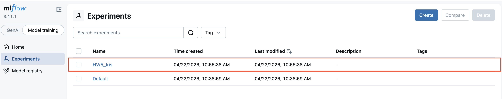

**Параметры запуска:**
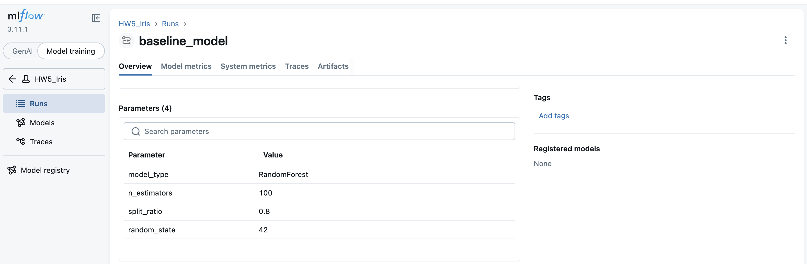

**Метрики:**
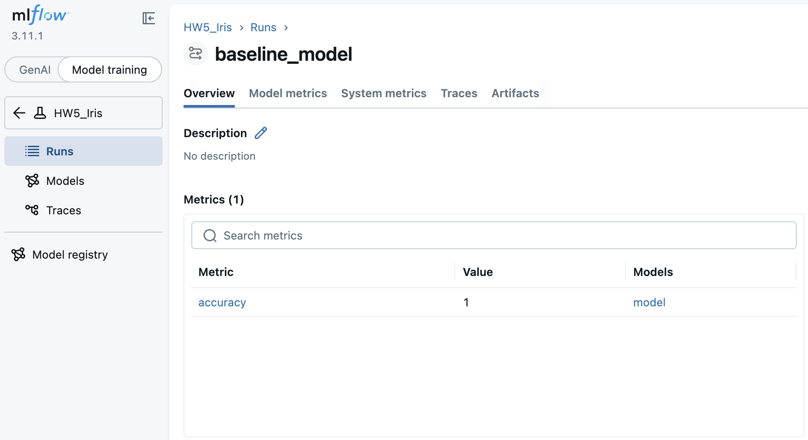

**Артефакты:**
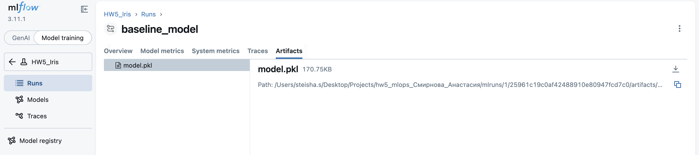

### Запуск MLflow UI

```bash
mlflow ui --backend-store-uri sqlite:///mlflow.db
# Открыть http://localhost:5000
```
### 2.4 Проверка воспроизводимости

Проект полностью воспроизводим. При клонировании репозитория и выполнении стандартных команд модель обучается и выдаёт **те же метрики** благодаря фиксированным `seed` и версиям библиотек.

**Шаги для проверки:**

```bash
# 1. Клонирование репозитория
git clone https://github.com/steishas/hw5_mlops_Smirnova_Anastasia.git
cd hw5_mlops_Smirnova_Anastasia

# 2. Создание и активация виртуального окружения (рекомендуется Python 3.12)
python3.12 -m venv venv_312
source venv_312/bin/activate  # для macOS/Linux

# 3. Установка зависимостей
pip install --upgrade pip
pip install -r requirements.txt

# 4. Получение данных из DVC
dvc pull

# 5. Воспроизведение пайплайна
dvc repro
```
**Ожидаемый результат:**

```text
Running stage 'prepare':
> python src/prepare.py
Train: 120, Test: 30

Running stage 'train':
> python src/train.py
Accuracy: 0.9

Data and pipelines are up to date.
```
**Примечания:**

При первом `dvc pull` скачиваются только исходные данные (`iris.csv`). Файлы `train.csv`, `test.csv`, `model.pkl` и `metrics.json` генерируются локально при выполнении `dvc repro`.

Для корректной установки всех зависимостей рекомендуется использовать Python 3.12. Некоторые пакеты (например, typed-ast) несовместимы с Python 3.14.
## 3. Feature Store (Feast)
**Конфигурация (feature_store.yaml)**

```yaml
project: hw5_iris_feature_store
registry: data/registry.db
provider: local
online_store:
    type: postgres
    host: localhost
    port: 8000
    database: postgres
    user: postgres
    password: mysecretpassword
    sslmode: disable
offline_store:
    type: file
```
**Валидация и применение**

```bash
cd feature_repo
yamllint feature_store.yaml
feast apply
```

**PostgreSQL (Docker)**
```bash
docker run --name feast-postgres \
  -e POSTGRES_PASSWORD=mysecretpassword \
  -p 8000:5432 \
  -d postgres:14
```
Использован Feast с online-хранилищем (`PostgreSQL`).

## 4. Готовность ML-системы к развёртыванию

| Компонент | Статус | Обоснование |
|-----------|--------|-------------|
| Версионирование кода | Готово | `Git` с понятной структурой |
| Версионирование данных | Готово | `DVC` отслеживает датасеты, данные не в `Git` |
| Воспроизводимость пайплайна | Готово | `dvc repro` воспроизводит все этапы |
| Трекинг экспериментов | Готово | `MLflow` логирует параметры, метрики, артефакты |
| Feature Store | Готово | `Feast с PostgreSQL` для online-признаков |
| CI/CD | Отсутствует | Требуется настройка `GitHub Actions` |
| API для инференса | Отсутствует | Требуется обёртка модели в `FastAPI` |
| Мониторинг | Отсутствует | Требуется отслеживание дрифта данных |

Текущая ML-система имеет базовый MLOps-фундамент и готова к ручному развёртыванию. Для полноценного продакшена необходимо добавить автоматизацию, API и мониторинг.

## 5. Схема ML-системы для размытия лиц

**Анализ текущей реализации**

Предоставленный в задании код обрабатывает видео синхронно и однопоточно:

- Каждый кадр читается последовательно через `cv2.VideoCapture`;
- Детекция лиц выполняется через `CascadeClassifier`;
- Размытие применяется покадрово;
- Результат записывается в выходной файл;
- Ограничения: Нет параллельной обработки, нет очереди сообщений, нет мониторинга.

**Целевая архитектура**
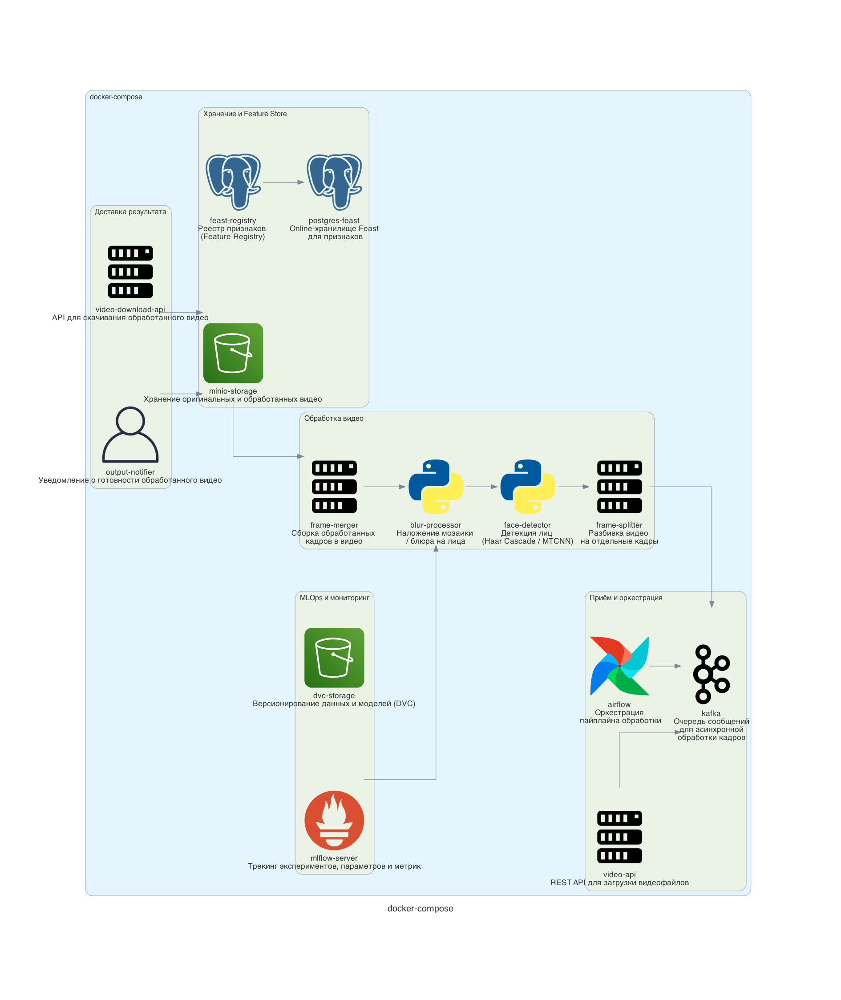
Диаграмма сгенерирована из `docker-compose-diagram.yml` с помощью библиотеки `docker-compose-diagram`.

| Слой | Компоненты | Решаемая проблема |
|------|------------|-------------------|
| **Приём и оркестрация** | API → Kafka → Airflow | Асинхронный приём, буферизация, управление пайплайном |
| **Обработка видео** | Splitter → Detector → Blur → Merger | Параллельная обработка кадров вместо однопоточной |
| **Хранение и Feature Store** | MinIO, PostgreSQL, Feast | Версионирование файлов и консистентность признаков |
| **MLOps и мониторинг** | MLflow, DVC | Воспроизводимость и трекинг метрик |
| **Доставка результата** | Notifier, Download API | Уведомление клиента о готовности |

Параллельная обработка кадров через очередь сообщений (`Kafka`) и пул воркеров (`Celery`) решает проблему однопоточности. `Feature Store (Feast)` хранит метаданные о детекциях, а `MLflow` и `DVC` обеспечивают воспроизводимость.
